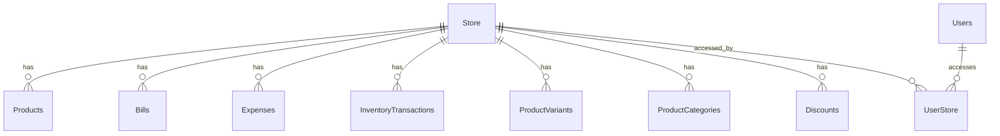

# Multi-Store Pivot Architecture Plan

## Overview
The current application is designed to manage a single store. To support multiple stores where each store has its own inventory, products, bills, expenses, and other resources, we need to introduce a Store entity and associate store-specific data with it.

## Current Architecture Analysis
- **Entities requiring store association:**
  - Products
  - Bills
  - Expenses
  - InventoryTransactions
  - ProductVariants
  - ProductCategories
  - Discounts
  - (Possibly others like JournalEntry, BillItems if not already linked)

- **Global entities:**
  - Users (can access multiple stores)
  - Accounts (business-level accounting)
  - UserProfiles

- **Current linking:** Many entities use `accountId` which seems to represent the business account, but for multi-store, we need `storeId`.

## Proposed Architecture

### Store Entity
```java
@Entity
public class Store {
    @Id
    @GeneratedValue(strategy = GenerationType.AUTO)
    private Long id;

    private String name;
    private String address;
    private String phone;
    private String email;
    private Boolean isActive;
    private LocalDateTime createdAt;
    private LocalDateTime updatedAt;

    // Getters and setters
}
```

### Store Association
- Add `private Long storeId;` to all store-specific entities.
- Update repositories to filter by `storeId`.
- Update services to accept and use `storeId` context.

### User-Store Relationship
- Users are global.
- Create a `UserStore` entity for many-to-many relationship:
```java
@Entity
public class UserStore {
    @Id
    @GeneratedValue
    private Long id;

    @ManyToOne
    private Users user;

    @ManyToOne
    private Store store;

    private String role; // e.g., admin, manager, cashier
}
```

### API Changes
- Include `storeId` in request paths: e.g., `/api/stores/{storeId}/products`
- Or use header: `X-Store-Id`
- Or derive from user context (selected store).

### Authentication & Authorization
- Update JWT to include current store context.
- Add store-based permissions.

### Database Schema Changes
- Add `store_id` column to relevant tables.
- Create `stores` table.
- Create `user_stores` table.
- Migration script to set default store for existing data.

### Architecture Diagram


## Implementation Steps
1. Create Store entity, repository, service, controller.
2. Create UserStore entity.
3. Add storeId to store-specific entities.
4. Update repositories with store filtering.
5. Update services to handle store context.
6. Update controllers for store-specific endpoints.
7. Update authentication to include store selection.
8. Create database migrations.
9. Update tests.

## Migration Strategy
- For existing single-store data, create a default Store and assign all existing records to it.
- Update application to require store selection on login or API calls.